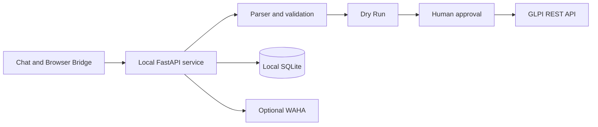
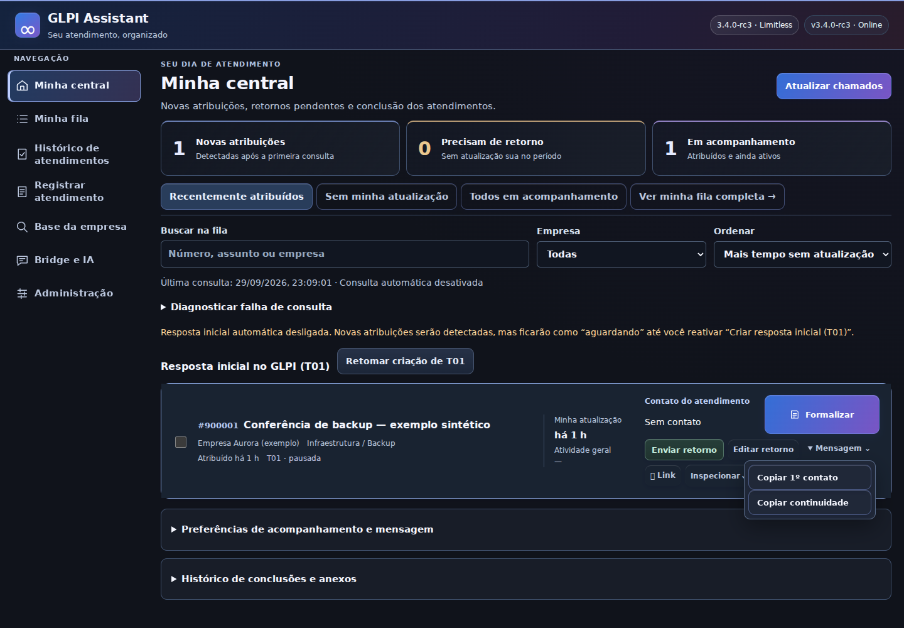
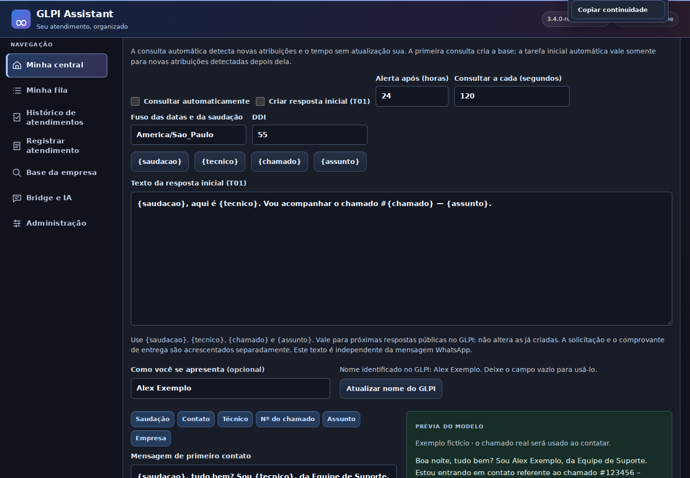

# GLPI Assistant

**Local Linux assistant for GLPI workflows with human review, Dry Run, evidence handling and proactive ticket creation.**

[](docs/CHANGELOG_3.4.0-rc4.md)
[](docs/browser-bridge.md)
[](https://github.com/ZeldrisMercy/glpi-assistant/actions/workflows/ci.yml)
[](docs/installation.md)
[](LEGAL_AND_OWNERSHIP.md)

[Português](README.md) · [Installation](docs/installation.md) · [Architecture](docs/architecture.md) · [Security](SECURITY.md) · [Validation](docs/validation.md)

> Sanitized snapshot of **3.4.0 RC4** with Browser Bridge **2.4.0**. The repository remains private while ownership, licensing and public distribution authorization are reviewed.

## What it solves

GLPI Assistant reduces repetitive support documentation while keeping the operator in control. Structured content becomes a local review, catalog fields are resolved against GLPI and writes occur only after human approval.

- **Structured closure:** converts notes into T01–T05 tasks with explicit E01/E02 evidence mapping.
- **Proactive tickets:** creates one or multiple tickets from a prompt, with reviewable entity, category, requester, priority, activities and screenshots.
- **Bound Dry Run:** approval is tied to the current payload and invalidated by relevant edits.
- **Batch operation:** isolates successes and failures, returning receipts and GLPI links.
- **Browser Bridge:** carries prompt content, timestamps and evidence into the local service.
- **Optional messaging:** integrates WAHA with recipient verification, idempotency and delivery states.

## Architecture



The Bridge transports content; it does not authorize GLPI changes. The server resolves catalog values, records intent before remote mutations and requires approval for the current plan. See the [threat model](docs/threat-model.md) and [architecture decisions](docs/adr/).

## Main workflows

### Close an existing ticket

1. Load the ticket and paste the structured formalization.
2. Review T01–T05, category, context and evidence.
3. Run the Dry Run and approve the plan.
4. Inspect the receipt and re-read tasks from GLPI.

T01–T05 represent **Reported Problem → Identified Problem → Diagnosis → Applied Solution → Customer Validation**. Customer validation is never fabricated.

### Create proactive tickets

1. A prompt may describe one or multiple completed support activities.
2. Review resolves entity, category, location, requester, technician, priority and activities.
3. The operator fixes pending fields and approves each plan.
4. Tickets are created sequentially with idempotency, uncertain-result reconciliation and per-ticket receipts.

Default type: **Request**. Default priority: **Low/Medium**. High or above requires an explicit choice. See the [complete contract](docs/proactive-ticket-creation.md).

## Interface

Screenshots show the real UI with synthetic data and mocked APIs. No GLPI write or real message was performed to create them.


<details>
<summary>More screenshots</summary>





</details>

[Gallery methodology and boundaries](docs/assets/screenshots/README.md)

## Run locally

```bash
python3 -m venv .venv
. .venv/bin/activate
pip install -r package/usr/lib/glpi-assistant/app/requirements.txt -r requirements-dev.txt
GLPI_ASSISTANT_DATA="$PWD/.local-data" uvicorn main:app \
  --app-dir package/usr/lib/glpi-assistant/app \
  --host 127.0.0.1 --port 8765
```

Open `http://127.0.0.1:8765`. Keep real credentials outside Git and review [installation effects](docs/installation.md) before connecting real services.

## Tests and build

```bash
GLPI_ASSISTANT_DATA="$PWD/.test-data" python -m pytest tests qa/test_waha_installer.py -q
python scripts/check_javascript.py
python scripts/build_portfolio.py
```

Recorded RC4 validation:

| Area | Result | Boundary |
|---|---:|---|
| Python | 260 tests passed | mocked remote integrations |
| JavaScript/DOM | 22 scripts passed | 16 files also pass syntax checks |
| Layout | 480, 768 and 1280 px | synthetic scenarios |
| Debian | metadata, syntax and extraction checked | real installation pending |

These results do not establish production homologation. See the [validation record](docs/validation.md).

## Repository map

| Path | Responsibility |
|---|---|
| `package/` | FastAPI application, UI and Debian packaging |
| `extension/` | Browser Bridge for Chromium and Firefox |
| `tests/`, `qa/` | Python, JavaScript, DOM and installer regressions |
| `scripts/`, `demo/` | reproducible build and synthetic scenarios |
| `security-3.4/` | experimental WAHA restriction candidate |
| `docs/` | architecture, operations, security and design decisions |

## Security and boundaries

- Loopback service with origin validation and a local token.
- Tokens, databases, WAHA sessions, real reports and historical archives are excluded.
- GLPI writes require a current plan and human approval; contact automations have separate auditable authorization.
- Uncertain results never trigger an automatic POST or upload retry.
- The application remains local and single-operator; hosted authentication and multiuser RBAC are roadmap items.

[Security policy](SECURITY.md) · [Privacy](docs/privacy-and-data.md) · [Known limitations](docs/known-limitations.md) · [Roadmap](ROADMAP.md) · [Changelog](CHANGELOG.md)

## License and distribution

No open source license has been assigned to this snapshot. Ownership and public distribution authorization still require review. Third-party notices, including WAHA, are retained in [LEGAL_AND_OWNERSHIP.md](LEGAL_AND_OWNERSHIP.md) and [NOTICE.md](NOTICE.md).
