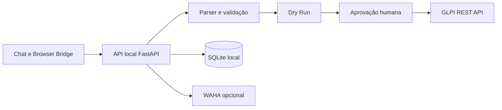

# GLPI Assistant

**Assistente Linux local para fluxos GLPI com revisão humana, Dry Run, evidências e criação proativa de chamados.**

[](docs/CHANGELOG_3.4.0-rc4.md)
[](docs/browser-bridge.md)
[](https://github.com/ZeldrisMercy/glpi-assistant/actions/workflows/ci.yml)
[](docs/installation.md)
[](LEGAL_AND_OWNERSHIP.md)

[English](README.en.md) · [Instalação](docs/installation.md) · [Arquitetura](docs/architecture.md) · [Segurança](SECURITY.md) · [Validação](docs/validation.md)

> Snapshot sanitizado da **3.4.0 RC4**, com Browser Bridge **2.4.0**. O repositório está privado enquanto titularidade, licença e autorização de distribuição pública são revisadas.

## O que o projeto resolve

O GLPI Assistant reduz o trabalho repetitivo na formalização de suporte sem retirar o controle do operador. O fluxo transforma conteúdo estruturado em uma revisão local, valida os campos contra o GLPI e só executa as escritas depois da aprovação humana.

- **Fechamento estruturado:** converte a formalização em T01–T05, com associação explícita de evidências E01, E02…
- **Criação proativa:** cria um ou vários chamados a partir do prompt, com entidade, categoria, requerente, prioridade, atividades e prints revisáveis.
- **Dry Run vinculante:** gera um plano ligado ao conteúdo; qualquer edição relevante invalida a aprovação anterior.
- **Operação em lote:** mantém sucessos e falhas isolados, com recibos e links para o GLPI.
- **Browser Bridge:** transporta prompt, timestamp e evidências do navegador para o serviço local.
- **Mensageria opcional:** integra WAHA com verificação do destinatário, idempotência e estados de entrega.

## Arquitetura



O Bridge entrega conteúdo; ele não autoriza alterações no GLPI. O servidor resolve catálogos, registra a intenção antes das mutações remotas e exige uma aprovação associada ao plano atual. Consulte o [modelo de ameaças](docs/threat-model.md) e as [decisões arquiteturais](docs/adr/).

## Fluxos principais

### Formalizar um chamado existente

1. Carregue o chamado e cole a formalização estruturada.
2. Revise T01–T05, categoria, contexto e evidências.
3. Execute o Dry Run e aprove o plano.
4. Confira o recibo e a releitura das tarefas no GLPI.

O contrato T01–T05 representa **Problema Informado → Problema Identificado → Diagnóstico → Solução Aplicada → Validação do Cliente**. A validação nunca é inventada.

### Criar chamados proativos

1. O prompt pode descrever um ou vários atendimentos.
2. A revisão resolve entidade, categoria, localização, requerente, técnico, prioridade e atividades.
3. O operador corrige pendências e aprova cada plano.
4. A criação ocorre sequencialmente, com idempotência, reconciliação de resultado incerto e comprovante por chamado.

Tipo padrão: **Requisição**. Prioridade padrão: **Baixa/Média**. Alta ou superior exige escolha explícita. [Contrato completo](docs/proactive-ticket-creation.md).

## Interface

Capturas da interface real com dados sintéticos e APIs simuladas. Nenhuma escrita no GLPI ou mensagem real foi executada para gerar estas imagens.


<details>
<summary>Ver mais capturas</summary>


</details>

[Metodologia e limites da galeria](docs/assets/screenshots/README.md)

## Executar localmente

```bash
python3 -m venv .venv
. .venv/bin/activate
pip install -r package/usr/lib/glpi-assistant/app/requirements.txt -r requirements-dev.txt
GLPI_ASSISTANT_DATA="$PWD/.local-data" uvicorn main:app \
  --app-dir package/usr/lib/glpi-assistant/app \
  --host 127.0.0.1 --port 8765
```

Abra `http://127.0.0.1:8765`. Mantenha tokens e configurações reais fora do Git. Antes de conectar ambientes reais, leia [instalação e efeitos operacionais](docs/installation.md).

## Testes e build

```bash
GLPI_ASSISTANT_DATA="$PWD/.test-data" python -m pytest tests qa/test_waha_installer.py -q
python scripts/check_javascript.py
python scripts/build_portfolio.py
```

Validação registrada para a RC4:

| Área | Resultado | Limite |
|---|---:|---|
| Python | 260 testes aprovados | integrações remotas simuladas |
| JavaScript/DOM | 22 scripts aprovados | 16 arquivos também passam por verificação sintática |
| Layout | 480, 768 e 1280 px | amostras sintéticas |
| Debian | metadados, sintaxe e extração verificados | instalação real pendente |

Esses resultados não comprovam homologação em produção. Veja o [registro de validação](docs/validation.md).

## Organização do repositório

| Caminho | Responsabilidade |
|---|---|
| `package/` | aplicação FastAPI, interface e empacotamento Debian |
| `extension/` | Browser Bridge para Chromium e Firefox |
| `tests/`, `qa/` | regressões Python, JavaScript, DOM e instalador |
| `scripts/`, `demo/` | build reproduzível e cenários sintéticos |
| `security-3.4/` | candidato experimental de restrições WAHA |
| `docs/` | arquitetura, operação, segurança e decisões técnicas |

## Segurança e limites

- Serviço ligado a `127.0.0.1`, com validação de origem e token local.
- Tokens, bancos, sessões WAHA, relatórios reais e históricos são excluídos do repositório.
- Escritas no GLPI exigem plano atual e aprovação humana; automações de contato têm autorização própria e auditável.
- Resultados incertos não provocam repetição automática de POST ou upload.
- A aplicação permanece local e mono-operador; autenticação web multiusuário e RBAC estão no roadmap.

[Política de segurança](SECURITY.md) · [Privacidade](docs/privacy-and-data.md) · [Limitações conhecidas](docs/known-limitations.md) · [Roadmap](ROADMAP.md) · [Changelog](CHANGELOG.md)

## Licença e distribuição

Nenhuma licença open source foi atribuída a este snapshot. A titularidade e a autorização de publicação pública ainda precisam de revisão. Licenças de terceiros, incluindo WAHA, foram preservadas em [LEGAL_AND_OWNERSHIP.md](LEGAL_AND_OWNERSHIP.md) e [NOTICE.md](NOTICE.md).
