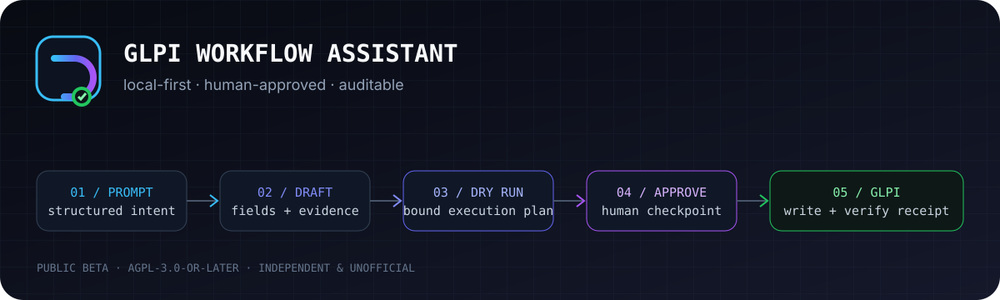
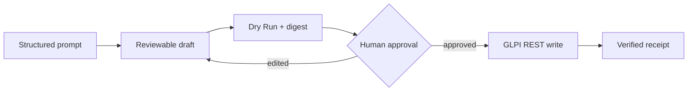
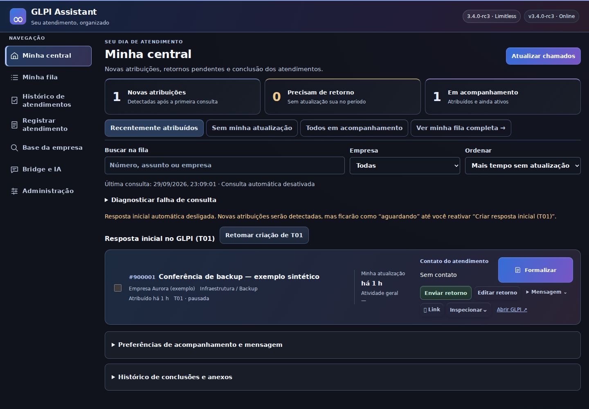
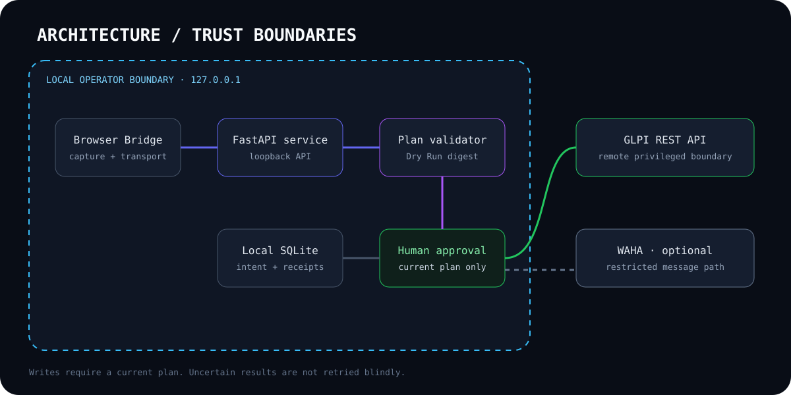

<p align="center">
  
</p>

<p align="center">
  <a href="docs/project/release-manifest.json"></a>
  <a href="LICENSE"></a>
  <a href=".github/workflows/ci.yml"></a>
  <a href="docs/getting-started/quick-start.md"></a>
  
  
</p>

<p align="center"><strong>An independent, local-first workflow assistant for GLPI with Dry Run, human approval, evidence handling and auditable automation.</strong></p>

<p align="center">
  <strong><a href="README.pt-BR.md">Português</a></strong> · Quick start · Architecture · Security · Evidence
</p>

[Português](README.pt-BR.md) · [Quick start](#quick-start) · [Architecture](docs/architecture.md) · [Security](SECURITY.md) · [Evidence gallery](docs/assets/screenshots/README.md)

> [!IMPORTANT]
> This is an independent and unofficial public beta. It is not affiliated with
> or endorsed by the GLPI Project. Use a lab or synthetic dataset first; this
> repository does not claim production readiness.

## Why this project exists

Support work often ends with the same difficult trade-off: document every
technical step accurately without turning repetitive ticket updates into a
second job. GLPI Workflow Assistant explores a safer automation boundary. It
structures operator input, resolves catalog data, binds a Dry Run to the exact
payload and waits for human approval before privileged writes.

The project is deliberately local-first. The FastAPI service listens on
loopback, keeps operational state in local SQLite and treats browser or
AI-generated content as input—not authorization.

## Controlled workflow

1. **Capture intent** — accept a structured closure or one/many proactive ticket drafts.
2. **Resolve fields** — validate entity, category, requester, technician, priority and evidence.
3. **Dry Run** — generate a plan and digest for the current payload.
4. **Human approval** — edits invalidate the previous plan.
5. **Execute and verify** — write through the GLPI REST API and return an inspectable receipt.



## What is included

- Existing-ticket closure with T01–T05 tasks and explicit E01/E02 evidence mapping.
- Proactive single or batch ticket creation with idempotency and partial-result isolation.
- Approval invalidation when relevant payload fields change.
- Browser Bridge 2.4.0 for Chromium-based browsers and Firefox development use.
- Optional restricted WAHA path with recipient verification and no blind resend after uncertainty.
- Deterministic Debian and extension artifacts, SHA-256 checksums and a scoped CycloneDX SBOM.

## Safety model

- GLPI writes require a current plan and explicit approval.
- Uncertain POST/upload outcomes are reconciled instead of retried blindly.
- Evidence is associated by stable identifiers, not screenshot order alone.
- Loopback origin and local-token checks protect the local service boundary.
- Synthetic fixtures generate demos and screenshots; publication scans cover source and archives.
- Optional messaging has separate enablement, recipient-binding and delivery-state controls.

See the [security policy](SECURITY.md), [threat model](docs/security/threat-model.md),
[privacy boundary](docs/security/privacy.md) and
[known limitations](docs/project/known-limitations.md).

## Interface evidence

The gallery uses the real application HTML/CSS/JavaScript with intercepted,
synthetic API fixtures. It performs no real GLPI write or message delivery.



[Open the evidence gallery and methodology →](docs/assets/screenshots/README.md)

## Architecture



The Browser Bridge transports context; it does not authorize changes. The
local service owns parsing, validation, plan binding, state and receipts. GLPI
and optional WAHA remain remote trust boundaries.

## Quick start

Requirements: Linux, Python 3.12+, Node.js 24+ for the regression suite, and
Docker only for the packaged runtime path.

```bash
python3 -m venv .venv
. .venv/bin/activate
python -m pip install -r package/usr/lib/glpi-assistant/app/requirements.txt -r requirements-dev.txt
GLPI_ASSISTANT_DATA="$PWD/.local-data" uvicorn main:app \
  --app-dir package/usr/lib/glpi-assistant/app \
  --host 127.0.0.1 --port 8765
```

Open `http://127.0.0.1:8765`. Start without real credentials, then follow the
[installation guide](docs/getting-started/quick-start.md) and
[configuration reference](docs/getting-started/configuration.md).

## Verify the snapshot

```bash
GLPI_ASSISTANT_DATA="$(mktemp -d)" python -m pytest tests qa/test_waha_installer.py -q
python scripts/check_javascript.py
python scripts/build_portfolio.py
python scripts/verify_release.py dist
python scripts/audit_publication.py . dist
```

Release `3.4.0-beta.1` and Browser Bridge `2.4.0` are derived from
[`docs/project/release-manifest.json`](docs/project/release-manifest.json).
Automated regression coverage uses simulated remote integrations; clean-host
installation and live interoperability are separate acceptance boundaries.

## Repository map

| Path | Responsibility |
|---|---|
| `package/` | FastAPI application, local UI and Debian filesystem layout |
| `extension/` | Browser Bridge for Chromium and Firefox |
| `tests/`, `qa/` | Python, JavaScript, DOM, installer and security regressions |
| `scripts/` | Reproducible build, audit, capture and release verification |
| `demo/` | Synthetic input and screenshot scenarios |
| `patches/` | Separately documented WAHA patch boundary |
| `docs/` | Architecture, setup, security, evidence and project decisions |

## Skills demonstrated

Python/FastAPI · REST API integration · Linux/Debian packaging · Docker ·
applied security · testing · CI/CD · human-in-the-loop automation · technical
documentation · reproducible release engineering.

## Project status

This beta is suitable for code review, lab evaluation and portfolio evidence.
It is not a hosted multi-user service, a security-certified product or a
promise of compatibility with systems other than the documented GLPI flow.
Roadmap ideas are not current capabilities.

## Contributing and license

Read [CONTRIBUTING.md](CONTRIBUTING.md), [SUPPORT.md](SUPPORT.md) and the
[Code of Conduct](CODE_OF_CONDUCT.md). Original project code is available
under `AGPL-3.0-or-later`; third-party boundaries are described in
[NOTICE.md](NOTICE.md).
