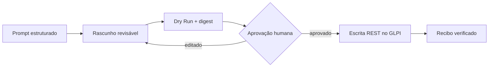
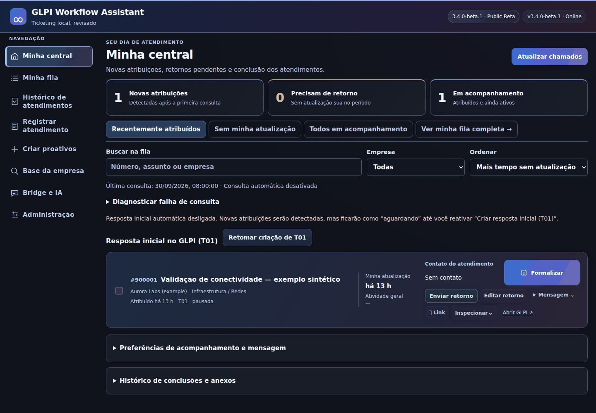

<p align="center">
  
</p>

<p align="center">
  <a href="docs/project/release-manifest.json"></a>
  <a href="LICENSE"></a>
  <a href=".github/workflows/ci.yml"></a>
  <a href="docs/getting-started/quick-start.md"></a>
  
  
</p>

<p align="center"><strong>Um assistente independente e local-first para workflows GLPI, com Dry Run, aprovação humana, tratamento de evidências e automação auditável.</strong></p>

<p align="center">
  <strong><a href="README.md">English</a></strong> · Início rápido · Arquitetura · Segurança · Evidências
</p>

[English](README.md) · [Início rápido](#início-rápido) · [Arquitetura](docs/architecture.md) · [Segurança](SECURITY.md) · [Galeria de evidências](docs/assets/screenshots/README.md)

> [!IMPORTANT]
> Esta é uma beta pública independente e não oficial. O projeto não possui
> afiliação nem endosso do GLPI Project. Comece em laboratório ou com dados
> sintéticos; este repositório não afirma prontidão para produção.

## Por que este projeto existe

O trabalho de suporte termina muitas vezes com o mesmo dilema: documentar cada
etapa técnica com qualidade sem transformar atualizações repetitivas em um
segundo atendimento. O GLPI Workflow Assistant explora uma fronteira mais
segura para automação. Ele estrutura a entrada do operador, resolve catálogos,
vincula o Dry Run ao payload exato e aguarda aprovação humana antes de escritas
privilegiadas.

O projeto é intencionalmente local-first. O serviço FastAPI escuta em loopback,
mantém estado operacional em SQLite local e trata conteúdo do navegador ou
gerado por IA como entrada — nunca como autorização.

## Fluxo controlado

1. **Capturar a intenção** — aceitar fechamento estruturado ou um/vários rascunhos proativos.
2. **Resolver campos** — validar entidade, categoria, requerente, técnico, prioridade e evidências.
3. **Dry Run** — gerar plano e digest para o payload atual.
4. **Aprovação humana** — edições invalidam o plano anterior.
5. **Executar e verificar** — escrever pela API REST do GLPI e devolver um recibo inspecionável.



## O que está incluído

- Fechamento de chamado existente com tarefas T01–T05 e associação explícita E01/E02.
- Criação proativa unitária ou em lote com idempotência e isolamento de resultados parciais.
- Invalidação da aprovação quando campos relevantes mudam.
- Browser Bridge 2.4.0 para navegadores Chromium e uso de desenvolvimento no Firefox.
- Caminho WAHA opcional e restrito, com validação do destinatário e sem reenvio cego após incerteza.
- Artefatos Debian/extensão determinísticos, hashes SHA-256 e SBOM CycloneDX com escopo declarado.

## Modelo de segurança

- Escritas no GLPI exigem plano atual e aprovação explícita.
- Resultados incertos de POST/upload são reconciliados, não repetidos cegamente.
- Evidências são vinculadas por identificadores estáveis, não apenas pela ordem das imagens.
- Origem loopback e token local protegem a fronteira do serviço.
- Fixtures sintéticas geram demonstrações; a publicação examina código e arquivos empacotados.
- Mensageria opcional possui controles próprios de ativação, vínculo e entrega.

Consulte a [política de segurança](SECURITY.md), o
[modelo de ameaças](docs/security/threat-model.md), a
[fronteira de privacidade](docs/security/privacy.md) e as
[limitações conhecidas](docs/project/known-limitations.md).

## Evidências da interface

A galeria usa o HTML/CSS/JavaScript real da aplicação com respostas de API
sintéticas e interceptadas. Nenhuma escrita real no GLPI ou entrega de mensagem
é realizada.



[Abrir a galeria e a metodologia →](docs/assets/screenshots/README.md)

## Arquitetura


O Browser Bridge transporta contexto; ele não autoriza alterações. O serviço
local controla parsing, validação, vínculo do plano, estado e recibos. GLPI e
WAHA opcional permanecem fronteiras remotas.

## Início rápido

Requisitos: Linux, Python 3.12+, Node.js 24+ para a suíte de regressão e Docker
somente para o caminho empacotado.

```bash
python3 -m venv .venv
. .venv/bin/activate
python -m pip install -r package/usr/lib/glpi-assistant/app/requirements.txt -r requirements-dev.txt
GLPI_ASSISTANT_DATA="$PWD/.local-data" uvicorn main:app \
  --app-dir package/usr/lib/glpi-assistant/app \
  --host 127.0.0.1 --port 8765
```

Abra `http://127.0.0.1:8765`. Comece sem credenciais reais e depois siga o
[guia de instalação](docs/getting-started/quick-start.md) e a
[referência de configuração](docs/getting-started/configuration.md).

## Verificar o snapshot

```bash
GLPI_ASSISTANT_DATA="$(mktemp -d)" python -m pytest tests qa/test_waha_installer.py -q
python scripts/check_javascript.py
python scripts/build_portfolio.py
python scripts/verify_release.py dist
python scripts/audit_publication.py . dist
```

A release `3.4.0-beta.1` e o Browser Bridge `2.4.0` são derivados de
[`docs/project/release-manifest.json`](docs/project/release-manifest.json).
A cobertura automatizada usa integrações remotas simuladas; instalação em host
limpo e interoperabilidade real são fronteiras de aceitação separadas.

## Mapa do repositório

| Caminho | Responsabilidade |
|---|---|
| `package/` | Aplicação FastAPI, UI local e layout do pacote Debian |
| `extension/` | Browser Bridge para Chromium e Firefox |
| `tests/`, `qa/` | Regressões Python, JavaScript, DOM, instalador e segurança |
| `scripts/` | Build reproduzível, auditoria, captura e verificação de release |
| `demo/` | Entradas e cenários sintéticos |
| `patches/` | Fronteira de patches WAHA documentada separadamente |
| `docs/` | Arquitetura, instalação, segurança, evidências e decisões |

## Competências demonstradas

Python/FastAPI · integração de APIs REST · Linux/empacotamento Debian · Docker ·
segurança aplicada · testes · CI/CD · automação human-in-the-loop · documentação
técnica · engenharia de releases reproduzíveis.

## Estado do projeto

Esta beta é adequada para revisão de código, avaliação em laboratório e
evidência de portfólio. Ela não é um serviço hospedado multiusuário, produto
certificado ou promessa de compatibilidade com sistemas fora do fluxo GLPI
documentado. Itens de roadmap não são capacidades atuais.

## Contribuição e licença

Leia [CONTRIBUTING.md](CONTRIBUTING.md), [SUPPORT.md](SUPPORT.md) e o
[Código de Conduta](CODE_OF_CONDUCT.md). O código original do projeto está sob
`AGPL-3.0-or-later`; limites de terceiros estão em [NOTICE.md](NOTICE.md).
