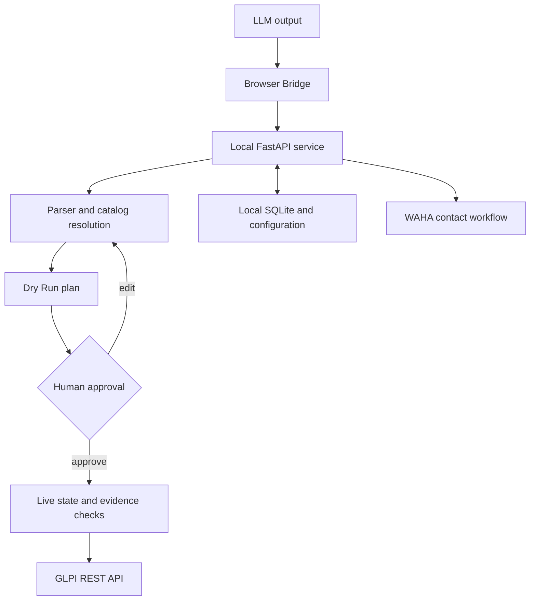

# Architecture

The LLM supplies untrusted text. The browser extension transports that text and identified images to a paired local service. The service parses it, resolves GLPI catalog entries, builds a plan and displays the changes for human approval.

The closure plan has an opaque identifier, expiry, payload/evidence binding and consumption tracking. The service rechecks ticket and task state before applying it. GLPI operations can partially succeed; the UI displays partial results and retains pending work. This is not an atomic transaction across GLPI, storage and messaging.

Assignment monitoring is a separate automation. Once enabled, it can create initial GLPI replies and initiate configured WhatsApp contact. Therefore, human approval of each closure does not imply that every background write receives per-operation approval.

| Service or boundary | Address / data | Limit |
|---|---|---|
| Assistant UI/API | `127.0.0.1:8765` | Loopback; no multiuser authentication/RBAC |
| WAHA API | `127.0.0.1:3000` | API key; separate Docker container |
| GLPI | Operator-supplied HTTPS API URL | GLPI token permissions and entity/profile context |
| Browser Bridge | Pairing bearer token | No GLPI or WAHA credential in extension source |
| Persistent host state | `/var/lib/glpi-assistant/data` | Sensitive local state, directory mode 0700 |
| App config | `config.json` | Mode 0600, not committed |
| Database | `app.db` | Local catalogs, handoffs and automation metadata |
| WAHA session | Separate persistent session directory | Never included in source or screenshots |

Proactive ticket creation is a separate privileged write path with its own contract, plan binding, durable operation record and reconciliation rules. See [proactive creation](proactive-ticket-creation.md).
