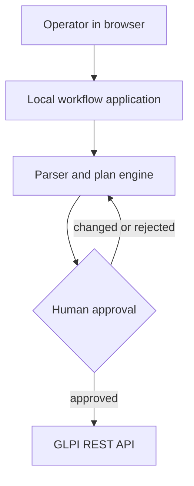

# System overview

GLPI Workflow Assistant is a local-first workflow layer around ticketing. GLPI
is the first supported integration, not the project identity. The browser UI,
parser, plan engine and local state run on the operator's machine. Remote writes
occur only after a reviewed Dry Run receives explicit human approval.

## Component responsibilities

- The UI owns review, evidence mapping and approval.
- The local API owns validation, idempotency and execution ordering.
- The GLPI adapter is the only component allowed to reach the ticketing API.
- Browser Bridge is optional and transports structured drafts over localhost.

Live behavior still depends on the permissions and API behavior of the target
GLPI deployment; the public evidence suite validates the offline boundary, not
an unowned production environment.
