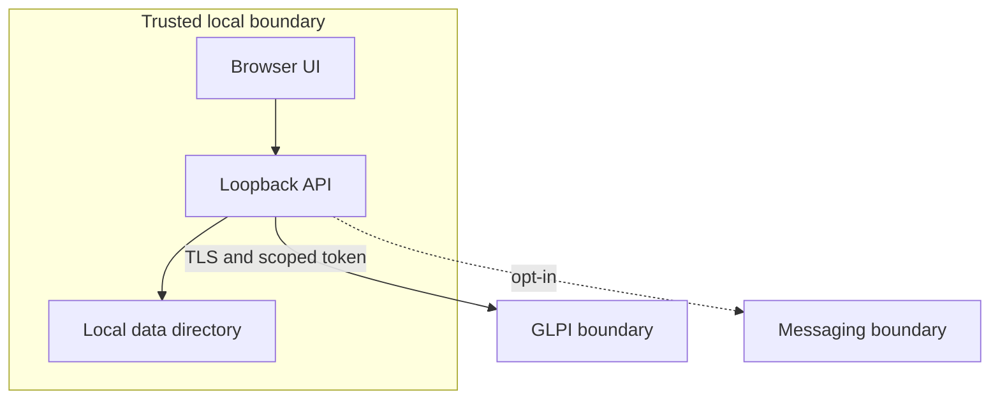

# Trust boundaries

The strongest guarantee is structural: capture and tests use synthetic fixtures,
while normal operation confines secrets and state to the local machine. A remote
request is never treated as proof that a write succeeded; the adapter verifies
the resulting ticket state before presenting a receipt.

Credential rules:

- GLPI and optional messaging credentials stay outside the repository.
- The application binds to loopback by default.
- Dry Run data becomes stale after any relevant input changes.
- Screenshots and OCR reports are publication-gated artifacts.
- Optional integrations are described as optional and unverified until tested
  against an environment the operator is authorized to use.
