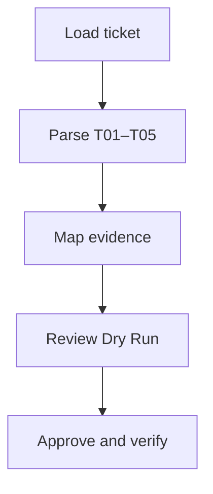
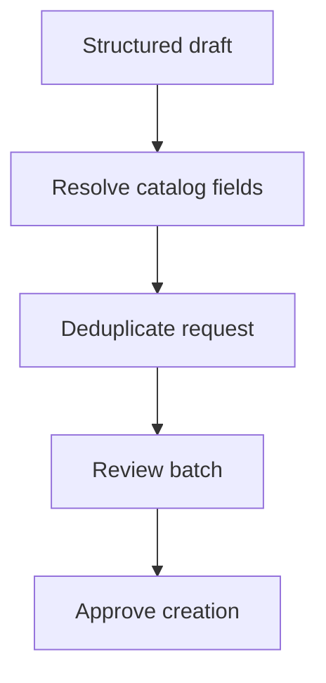
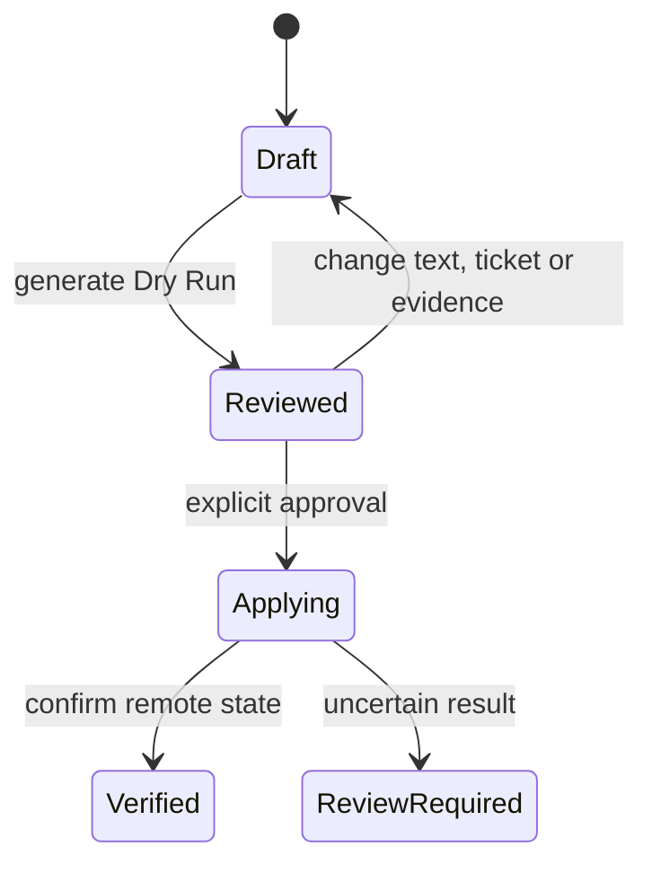
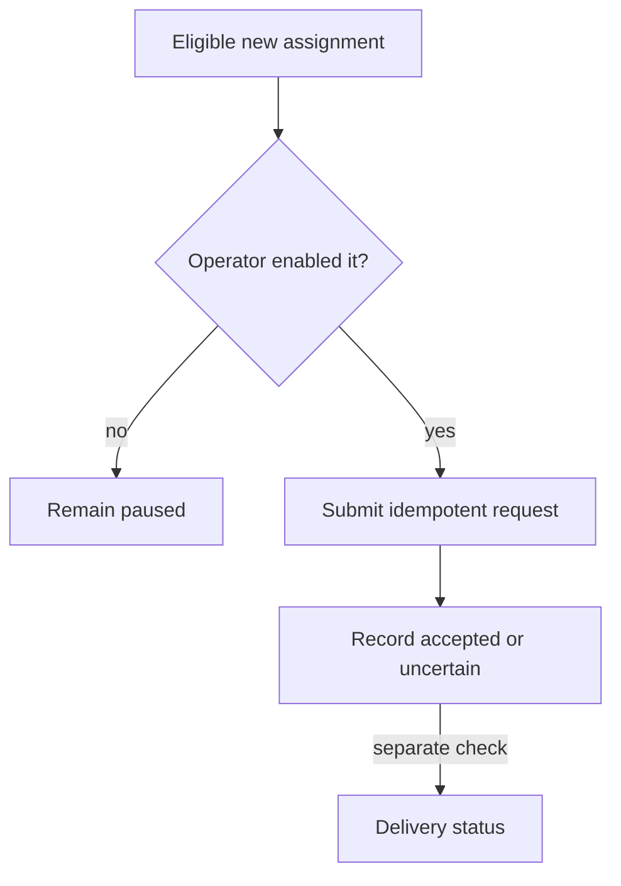

# Workflow diagrams

## Existing-ticket closure

## Proactive creation

## Approval invalidation

## Optional messaging

Messaging is not required for ticket closure. An accepted request is not called
delivered until a separate delivery status supports that claim.
