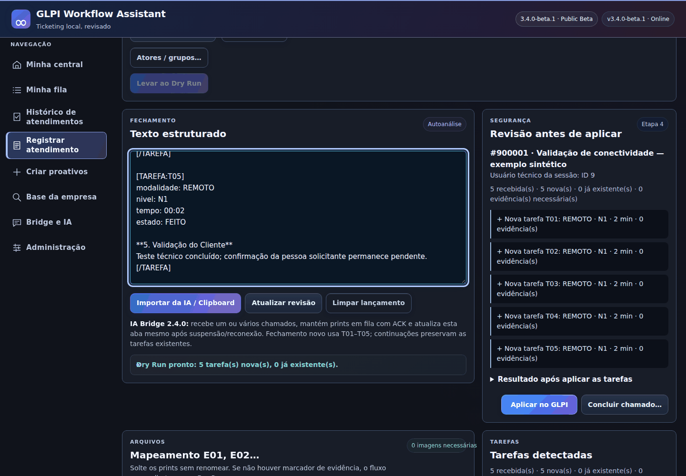

# Interface gallery

Real RC3 HTML/CSS/JavaScript, using synthetic ticket 900001 and intercepted local API responses. The parser is the real implementation. Dry Run and result responses are simulated fixtures; these images do not prove live GLPI execution. Capture script blocks external HTTPS requests. No credentials, pairing or real recipients are used.

Reproduce with `python scripts/capture_portfolio_screenshots.py` after installing Playwright Chromium. Optional `CHROMIUM_EXECUTABLE` selects a local QA browser. See [capture report](capture-report.json).

Batch/evidence association have regression coverage, but no additional screenshot is claimed here. Proactive creation does not exist in RC3 and has no screenshot.
